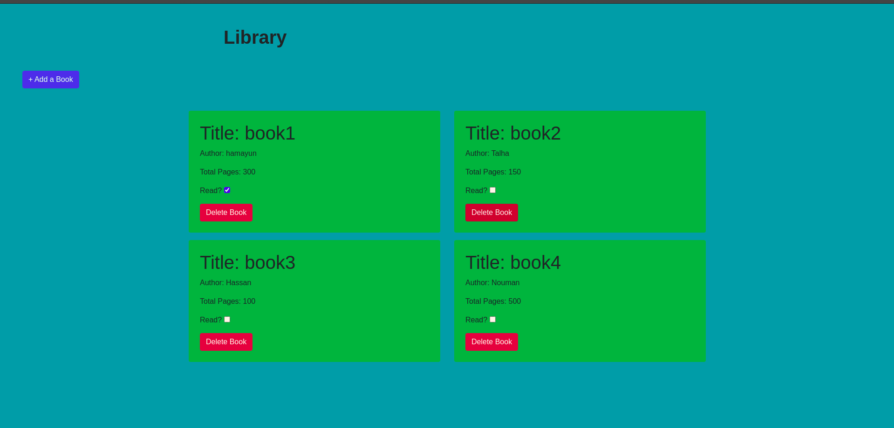

# Library

> This is the very first project of the Javascript module.

## Built With

- HTML
- CSS
- Bootstrap
- Javascript

## Live Demo

[Live Demo Link](https://hamayun-cpu.github.io/Library/)

## Getting Started

**To get a copy of the code please click on the green button on the top right corner that says code**
**And run in your console `git clone https://github.com/hamayun-cpu/Library.git`**

### Prerequisites

- Npm
- Node.js
- VS Code

## Author

👤 **Hamayun Waheed**

- Github: [@githubhandle](https://github.com/hamayun-cpu)
- Twitter: [@twitterhandle](https://twitter.com/hamayun_waheed?s=09&fbclid=IwAR0rfO9cMDDeCX8LfXf4cCNQDrL4LpJ02Q2csWhcT-VtMQ0Cy9EgTB4Wq8E)
- Linkedin: [linkedin](https://www.linkedin.com/in/hamayun-waheed-3527381b2/)

## 🤝 Contributing

Contributions, issues, and feature requests are welcome!

Feel free to check the [issues page](issues/).

## Show your support

Give a ⭐️ if you like this project!

## 📝 License

This project is [MIT](lic.url) licensed.
